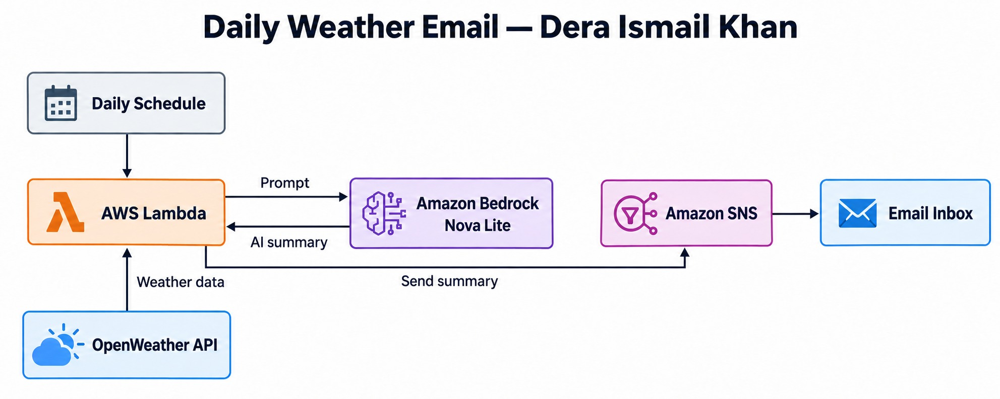
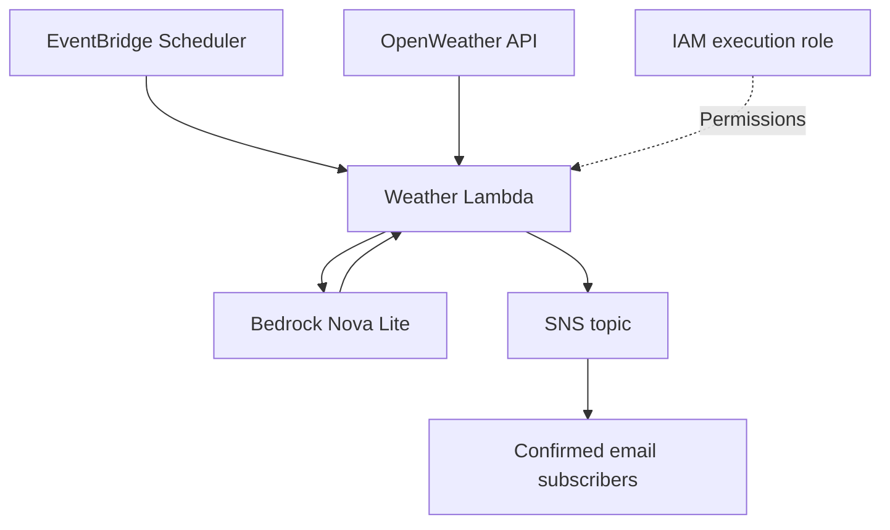

# AI Daily Weather Email — Dera Ismail Khan

Built by **Muhammad Luqman** using AWS Lambda, IAM, Amazon Bedrock Nova Lite, and email notifications.

This project retrieves current weather for Dera Ismail Khan, Pakistan, asks Nova Lite to produce a short summary with an umbrella recommendation and a practical tip, and delivers the result by email. The author reports receiving daily weather updates successfully. This repository provides a reproducible implementation based on the code shared during the project; it does not export or verify the live AWS configuration.

**The Lambda constructs the prompt. Nova Lite generates the email text. SNS or SES delivers the email.** The model does not send emails itself.

## Architecture





EventBridge Scheduler is the documented scheduling option for reproducing daily delivery; the author's original trigger was not supplied. The weather code uses SNS. SES is included as a separate optional extension for personalized birthday or event emails, rather than claiming it is called by the weather code.

## Files

| File | Purpose |
|---|---|
| `lambda_function.py` | Weather → Nova Lite InvokeModel → SNS |
| `examples/birthday_email.py` | Separate Lambda: greeting → Nova Lite → SES |
| `examples/birthday-event.json` | Example Scheduler target input |
| `iam/weather-policy.json` | Weather role permissions template |
| `iam/birthday-policy.json` | Optional SES role permissions template |
| `iam/scheduler-policy.json` | Scheduler permission to invoke Lambda |
| `layers/python.zip` | Original dependency ZIP supplied by the author |
| `layers/README.md` | ZIP contents and compatible layer instructions |

## Step 1 — Prepare your accounts

1. Sign in to AWS Console and select **US East (N. Virginia), us-east-1** for this guide.
2. Create an OpenWeather account, obtain an API key, and ensure it is active.
3. Keep that key out of GitHub. If a key has already been shared publicly, replace it.
4. Use an IAM identity with permission to create Lambda, IAM roles, SNS, and Scheduler resources and to invoke the chosen Bedrock model.

## Step 2 — Create the SNS email topic

1. Open **Amazon SNS → Topics → Create topic**.
2. Choose **Standard**, name it `daily-weather`, and create it.
3. Copy the topic ARN.
4. Open the topic and choose **Create subscription**.
5. Select **Email** and enter your email address.
6. Create the subscription and click the confirmation link in your inbox.
7. Each additional recipient must create and confirm their own subscription. SNS publishes the same message to all subscribers of that topic.

## Step 3 — Prepare Bedrock Nova Lite

1. Open Amazon Bedrock in `us-east-1` and check that **Amazon Nova Lite** is available to your account.
2. The weather code uses `amazon.nova-lite-v1:0` with **InvokeModel**, not Converse.
3. Its native JSON body uses `schemaVersion: messages-v1`, `messages`, and `inferenceConfig` with `maxTokens` and `temperature`.
4. If AWS requires an inference profile for your account, configure `BEDROCK_MODEL_ID` with an available profile such as `us.amazon.nova-lite-v1:0` and update IAM permissions for that profile and the foundation models in its destination regions. Do not change only the model ID and assume the original single-region policy covers it.

## Step 4 — Create Lambda's IAM role

1. Open **IAM → Roles → Create role**.
2. Select **AWS service → Lambda** as the trusted service.
3. Attach `AWSLambdaBasicExecutionRole` for CloudWatch Logs.
4. Name the role `weather-email-lambda-role` and create it.
5. Open the role → **Add permissions → Create inline policy → JSON**.
6. Paste `iam/weather-policy.json` after replacing `YOUR_ACCOUNT_ID` and the topic name if necessary.
7. Save it as `WeatherEmailPermissions`.

This role grants `bedrock:InvokeModel` and `sns:Publish`; it does not need AdministratorAccess.

## Step 5 — Create the weather Lambda

1. Open **Lambda → Create function → Author from scratch**.
2. Name it `ai-daily-weather-email`.
3. Choose a currently supported Python runtime, such as Python 3.12 if available, and select the role created above.
4. Create the function.
5. In `lambda_function.py`, paste this repository's `lambda_function.py` and choose **Deploy**.
6. Confirm the handler is `lambda_function.lambda_handler`.
7. Open **Configuration → General configuration → Edit**. Start with 128 MB memory and a **120-second timeout**; adjust after observing your actual execution times.
8. The reference implementation uses Python's built-in `urllib` and the runtime's boto3, so it does **not** need the original requests layer. See `layers/README.md` if reproducing a requests-based version.
9. Leave the function outside a VPC for this simple setup. If using a VPC, provide outbound internet access for OpenWeather and access to the AWS service endpoints.

## Step 6 — Set environment variables

Open **Configuration → Environment variables → Edit** and add:

| Key | Value |
|---|---|
| `OPENWEATHER_API_KEY` | Your active OpenWeather API key |
| `SNS_TOPIC_ARN` | ARN copied from your SNS topic |
| `WEATHER_CITY` | `Dera Ismail Khan,PK` |
| `BEDROCK_REGION` | `us-east-1` |
| `SNS_REGION` | `us-east-1` |
| `BEDROCK_MODEL_ID` | `amazon.nova-lite-v1:0` or your supported inference profile |

`AWS_REGION` is supplied by Lambda. Do not attempt to overwrite reserved Lambda environment variable names. These custom names avoid that conflict.

## Step 7 — Test one weather email

1. Open **Test → Create new event**.
2. Use the JSON input `{}` and name it `WeatherTest`.
3. Save and run the test. This sends an actual email to the confirmed topic subscribers.
4. Check the returned SNS message ID, your inbox or spam folder, and **Monitor → View CloudWatch logs**.
5. The expected result is a short weather summary. Wording changes between model invocations.
6. This endpoint returns current conditions; the summary is not a daily weather forecast.

## Step 8 — Schedule daily delivery

1. Open **Amazon EventBridge → Scheduler → Create schedule**.
2. Name it `daily-weather-8am`.
3. Choose **Recurring schedule → Cron-based schedule**.
4. Enter `cron(0 8 * * ? *)` for 8:00 AM every day.
5. Select **Asia/Karachi** as the timezone. Do not interpret the expression as UTC when using this timezone setting.
6. Turn the flexible time window **Off**.
7. Choose **AWS Lambda Invoke** as the target and select `ai-daily-weather-email`.
8. Set the target JSON input to `{}`.
9. Let Scheduler create an execution role with permission to invoke this Lambda, or use a Scheduler-trusted role with the policy in `iam/scheduler-policy.json` after substituting its ARN.
10. Review and create the schedule. Enable it and check the next scheduled delivery.

You choose the time yourself. For example, `cron(0 18 * * ? *)` sends at 6:00 PM in the selected timezone. Scheduler has minute-level precision and does not promise delivery at an exact second.

## Optional — Birthday wishes and other event emails

The same idea can send birthday wishes, anniversary greetings, meeting reminders, or another event message. You choose the event, recipient, date, and time yourself. This is an **extension example**; it is not presented as an already-tested part of the author's weather deployment.

Use **SES** for direct personalized emails. SNS is appropriate when all confirmed topic subscribers should receive the same message.

### A. Prepare SES

1. Open Amazon SES in `us-east-1`.
2. Go to **Verified identities → Create identity → Email address**.
3. Enter your sender address and complete email verification.
4. If the account is in the SES sandbox, also verify the recipient address. Request production access if you need to send to unverified recipients.
5. Check the SES sending status and quotas for that region.

### B. Create a separate greeting Lambda

1. Create a Python Lambda named `ai-event-email` with its own execution role.
2. Attach `AWSLambdaBasicExecutionRole` and the substituted `iam/birthday-policy.json`.
3. Paste `examples/birthday_email.py` into its `lambda_function.py` file. Keep the handler `lambda_function.lambda_handler`.
4. Set its timeout to 120 seconds.
5. Add `SES_FROM_EMAIL` (verified sender), `SES_TO_EMAIL` (intended recipient), `SES_REGION=us-east-1`, `BEDROCK_REGION=us-east-1`, and `BEDROCK_MODEL_ID=amazon.nova-lite-v1:0`.
6. Use the example event JSON, replace the name, and test with your own recipient address first.

### C. Choose the birthday or event schedule

1. In EventBridge Scheduler, create a schedule targeting `ai-event-email`.
2. Select **Asia/Karachi** and disable the flexible window.
3. For a birthday on 20 March at 9:00 AM every year, use `cron(0 9 20 3 ? *)`. Substitute the person's actual day and month.
4. For a single event, choose **One-time schedule** and enter its date and time instead.
5. Set target input to the JSON below, replacing the name and occasion:

```json
{
  "recipient_name": "Your friend",
  "occasion": "birthday"
}
```

6. Give the Scheduler execution role permission to invoke this greeting Lambda and create the schedule.
7. Change `occasion` to `anniversary` or another greeting event when appropriate. For factual meeting reminders, extend the prompt with the actual meeting details rather than letting the model invent them.

This simple SES example has one recipient configured per Lambda. For several people, use separate function configurations or add a controlled recipient lookup. Do not expose an unrestricted email-sending function publicly.

## Reliability and troubleshooting

| Problem | What to check |
|---|---|
| OpenWeather 401 | API key and activation status |
| OpenWeather 404 | City spelling and country code |
| Bedrock AccessDenied | Model permissions, region, and account access |
| Model requires inference profile | Configure a supported profile and matching IAM resources |
| Lambda timeout | Internet access, endpoint reachability, and timeout setting |
| SNS email missing | Subscription confirmation, topic ARN, and spam folder |
| SES MessageRejected | Verified sender, sandbox recipient verification, region, and sending status |
| Import or binary errors with layer | Use a Linux-compatible layer for the chosen runtime and architecture |

Scheduler and Lambda retries can cause duplicate emails; this simple reference has no persistent deduplication. For production, use a persistent idempotency key based on the event date/recipient, configure retries deliberately, and monitor failures with a dead-letter queue. These are improvements to implement, not existing features.

## Cost considerations

Nova Lite was chosen as the project's budget-oriented AI model. Short prompts and a small output-token limit help control usage. Bedrock inference, Lambda, Scheduler, SNS/SES, logs, and the weather API may incur charges depending on usage and current allowances. This is not a guaranteed free project. Consult current pricing rather than assuming a fixed monthly bill.

## Verification

The repository's Python files were syntax-checked. The author reports the deployed daily weather workflow works. The repository implementation and optional SES extension have not been run against the author's AWS account during documentation preparation.

## Clean up

1. Disable/delete schedules first to stop recurring invocations.
2. Delete demonstration Lambda functions and any optional Lambda layers.
3. Delete the SNS topic and subscriptions when no longer needed.
4. Remove project-specific IAM policies/roles after confirming nothing else uses them.
5. Remove optional SES identities only if they are no longer needed.
6. Review CloudWatch log retention and delete unused demo log groups.

## References

- [Amazon Nova Invoke API](https://docs.aws.amazon.com/nova/latest/userguide/using-invoke-api.html)
- [EventBridge Scheduler schedule types and timezones](https://docs.aws.amazon.com/scheduler/latest/UserGuide/schedule-types.html)
- [SES sandbox restrictions](https://docs.aws.amazon.com/ses/latest/dg/request-production-access.html)
- [Amazon Bedrock pricing](https://aws.amazon.com/bedrock/pricing/)
