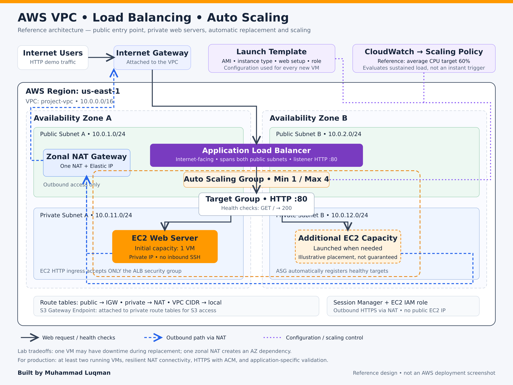
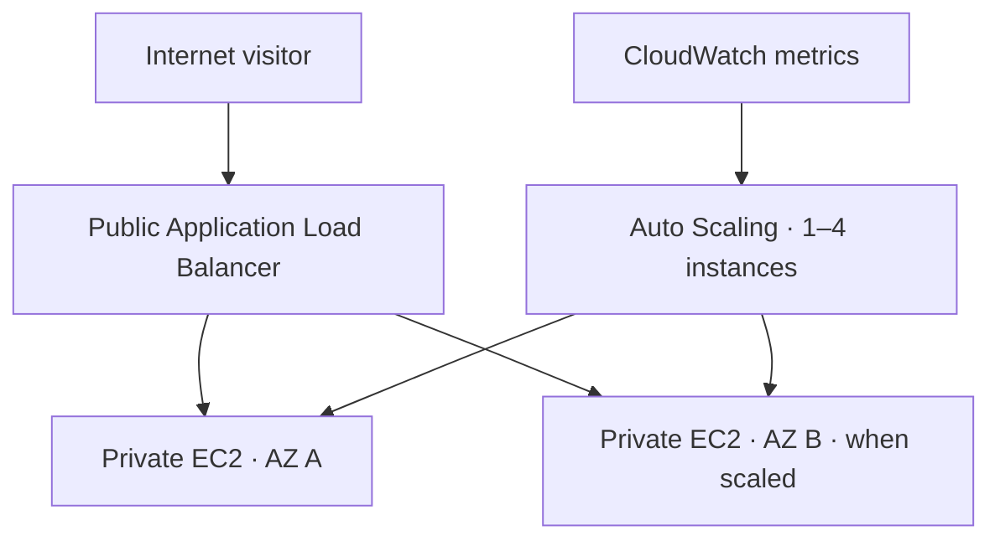

# AWS VPC, Load Balancing and Auto Scaling

Author: [Muhammad Luqman](https://github.com/Muahmmad-Luqman)

## Overview

A reproducible learning project with a public Application Load Balancer and private EC2 web servers. An Auto Scaling Group maintains desired capacity, replaces terminated instances, and adds capacity during sustained high load. Minimum capacity is 1 and maximum capacity is 4.

Plain-language scaling description: When VM load remains above approximately 60% for a period of time, Auto Scaling can launch additional VMs. It does not guarantee immediate scaling or exactly one additional instance.

The reproducible reference implementation uses the group's average CPU utilization with a target of 60. This is a chosen configuration, not confirmation of the author's original policy.

## Evidence and scope

The author reported successfully observing initial instance creation, replacement after termination, and an additional instance under sustained high load. Those are user-reported results, not tests performed by the assistant. No screenshots, deployment outputs, or original AWS configuration have been independently verified.

This package is a researched reference design. It has not been deployed to an AWS account. Do not present the new template as already cloud-tested.

## Architecture

The ALB spans two public subnets. The ASG can launch into two private subnets. Private instances use a zonal NAT Gateway for outbound connectivity. This lab uses ONE NAT Gateway to reduce resource count, which introduces an AZ dependency and possible cross-AZ data charges. For production resiliency, consider a zonal NAT per AZ or a supported regional NAT configuration after checking availability and pricing.

With only one running instance, the application is NOT continuously highly available across AZs. Replacement takes time and there can be downtime. Use a minimum and desired capacity of at least 2 for simultaneous two-AZ web capacity.

## Files

- `docs/BEGINNER_GUIDE.md`: console setup, verification, bounded tests, troubleshooting and cleanup.
- `docs/architecture.png`: high-resolution reference architecture diagram.
- `docs/architecture.svg`: editable diagram source.
- `infrastructure/template.yaml`: optional CloudFormation reference implementation.
- `scripts/user-data.sh`: Amazon Linux 2023 web-server bootstrap.

## Security

EC2 has no public IPv4 address and no inbound SSH rule. Only the ALB security group can reach the web servers on TCP 80. Session Manager is used for administrative access. IMDSv2 is required. The demonstration listener is HTTP, not production HTTPS. Add an ACM certificate and an HTTPS listener before transmitting private information.

## Start

Follow `docs/BEGINNER_GUIDE.md` for manual console deployment. Alternatively, open CloudFormation, create a standard stack, upload `infrastructure/template.yaml`, choose two different AZs, and acknowledge IAM resource creation. Do not perform both methods unless intentionally creating two separately charged environments.

The stack creates an IAM role, an EC2 instance profile and paid resources. Verify AWS permissions, quotas, pricing and your budget BEFORE creating it. Check stack outputs for the ALB URL and ASG name. CloudFormation deployment and EC2 bootstrap can take several minutes.

## Testing summary

| Test | Expected result | Evidence status |
|---|---|---|
| Initial ASG creation | One instance launches and eventually becomes healthy | User-reported on original lab |
| Instance termination | ASG restores desired capacity | User-reported on original lab |
| Sustained high CPU | Group may increase desired capacity up to four | User-reported on original lab |
| Website through ALB | Demo page responds after target health checks pass | Must verify on reference deployment |
| Recovery after load ends | Scale-in may occur after evaluation and warmup | Not reported; optional test |

## Cost and cleanup

This is NOT a guaranteed free project. NAT Gateway, ALB, EC2, EBS, public IPv4, data transfer and detailed monitoring can incur charges. AWS Budgets notifications are not hard spending caps. Burstable instances can incur CPU-credit charges depending on their credit configuration; load tests must be brief.

For template deployment, delete the CloudFormation stack and wait for `DELETE_COMPLETE`; verify leftover resources. For manual deployment, use the ordered cleanup checklist in the guide. Never simply terminate the instance while leaving the ASG active.

## Official research sources

- [VPC with private servers and NAT](https://docs.aws.amazon.com/vpc/latest/userguide/vpc-example-private-subnets-nat.html)
- [Auto Scaling network connectivity](https://docs.aws.amazon.com/autoscaling/ec2/userguide/asg-in-vpc.html)
- [Target tracking scaling](https://docs.aws.amazon.com/autoscaling/ec2/userguide/as-scaling-target-tracking.html)
- [Create an Application Load Balancer](https://docs.aws.amazon.com/elasticloadbalancing/latest/application/create-application-load-balancer.html)
- [Create a launch template](https://docs.aws.amazon.com/autoscaling/ec2/userguide/create-launch-template.html)
- [Session Manager prerequisites](https://docs.aws.amazon.com/systems-manager/latest/userguide/session-manager-prerequisites.html)

Console labels can change. Research date: 18 September 2026.
